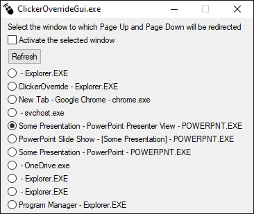

# Clicker Override

## Problem
When showing a presentation using an extended screen and using a remote clicker, the presentation window has to be focused for the clicker to work. This makes it impossible to use the computer and show a presentation at the same time.

## Solution
An AutoHotkey script to enable usage of remote presentation clickers in background windows.

## How it works
Usually next and previous keys on a clicker are really Page Up and Page Down keys. This AutoHotkey script intercepts Page Up and Page Down keys and sends them to the selected window. The script shows a GUI window listing all open windows. Sending the keys happens in the background and doesn't change focus. It works well with windows "PowerPoint Presenter View" and "Pympress Content" (Pympress is a pdf viewer which has similar functionality to the PowerPoint presenter view). But it doesn't work with most other windows. If needed, the checkbox "Activate the selected window" can be checked, which will raise the selected window before clicking. This mode can work with some other windows, for example Chrome, but it will interfere with other tasks, so its better to use the above metioned programs.

## Screenshot

